# Table of content:

## UX

- User stories
- Design choices
- Business goals
- Developer goals
- Wireframes

## Features

- Existing features
- Features left to be implemented

## Technologies used

## Bugs

## Testing

- Testing with validators
- Manual testing
- Room category selection
- Add extras

## Credits

- Content
- Media
- Code

## Deployment

---

# UX

- ## User stories

  ### As a newly found home cook

  - **I want** an easy way to find a recipe.
  - **So that** I can start preparing my meal for the upcoming days.

  ### As a parent

  - **I want** be able to find meals that are recommended for kids.
  - **So that** I can prepare a meal for my child as quickly as possible.

  ### As a first time view

  - **I want** to be able to register an account for myself.
  - **So that** I can post my recipes.

  ### As a returning registered user

  - **I want** to be able to update my recipes.
  - **So that** I can improve them.

  ### As a returning registered user

  - **I want** to be able to delete my recipes.
  - **So that** I don't have them anymore in my collection.

- ## Design choices

  I quite like the dark blue and it goes well with the curved edges. I used the Tailwind framework as it allowed me to quickly and efficiently build a responsive website. As the CSS file is compact, loading times are faster as well.

- ## Wireframes

  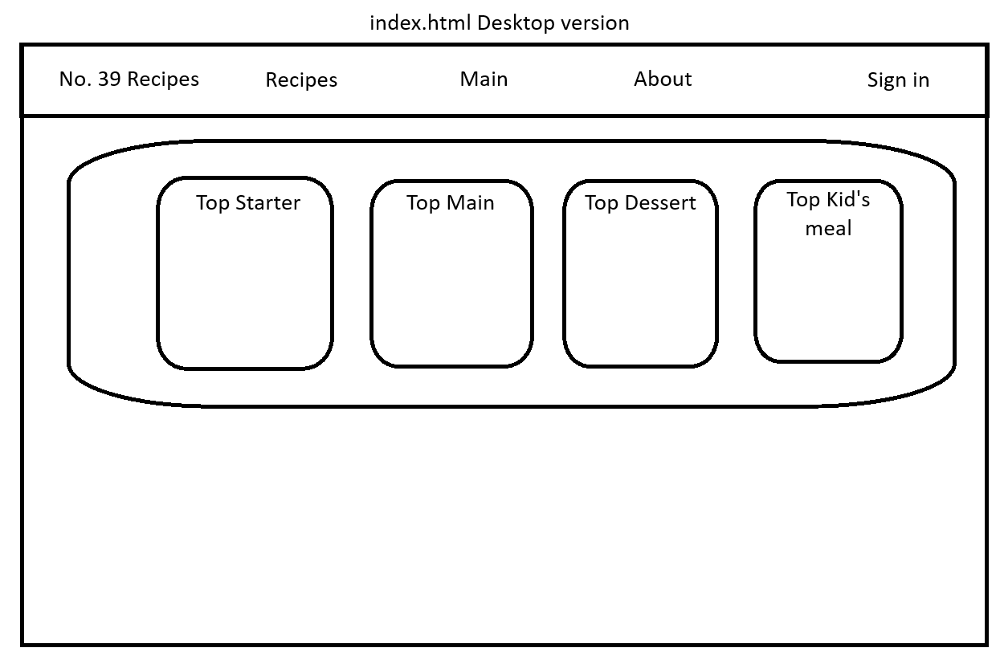
  
  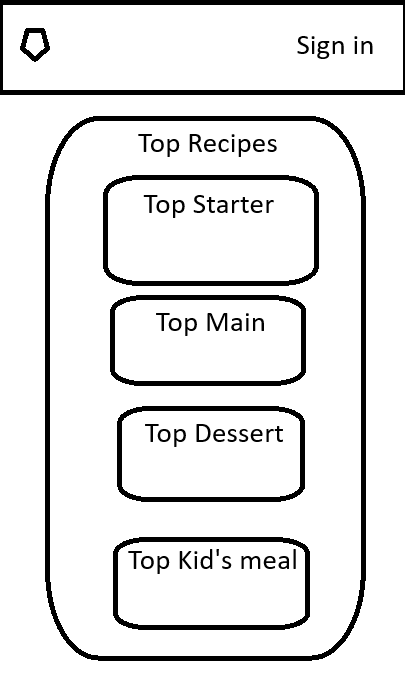
  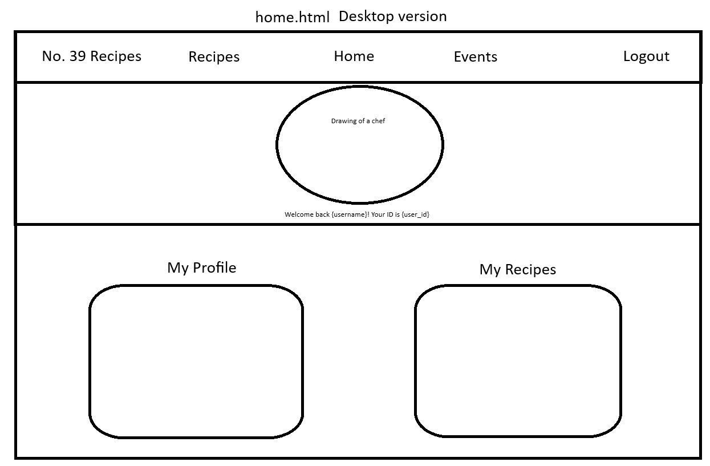
  
  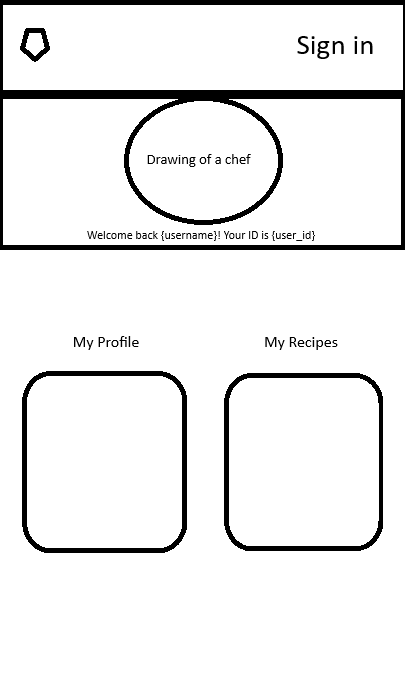
  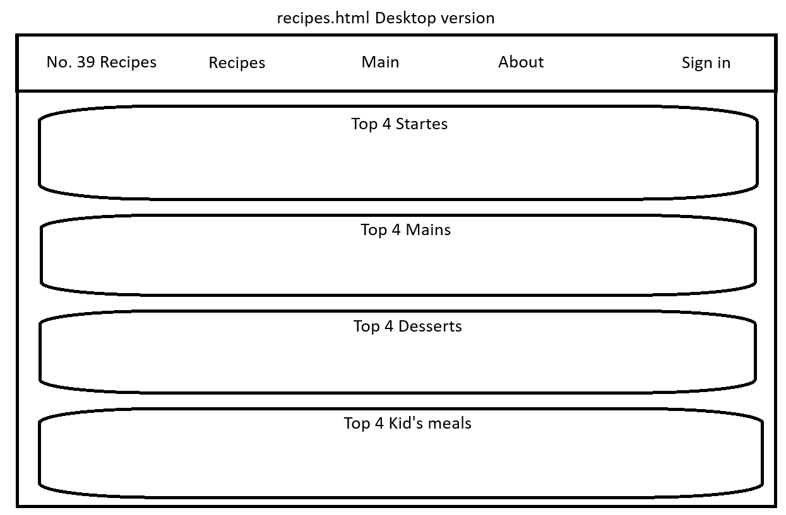
  
  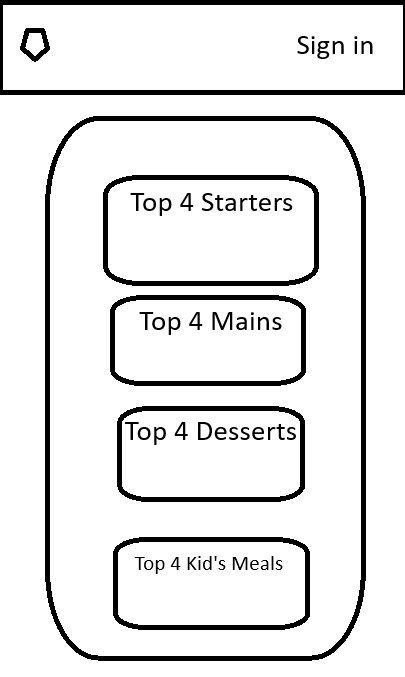
  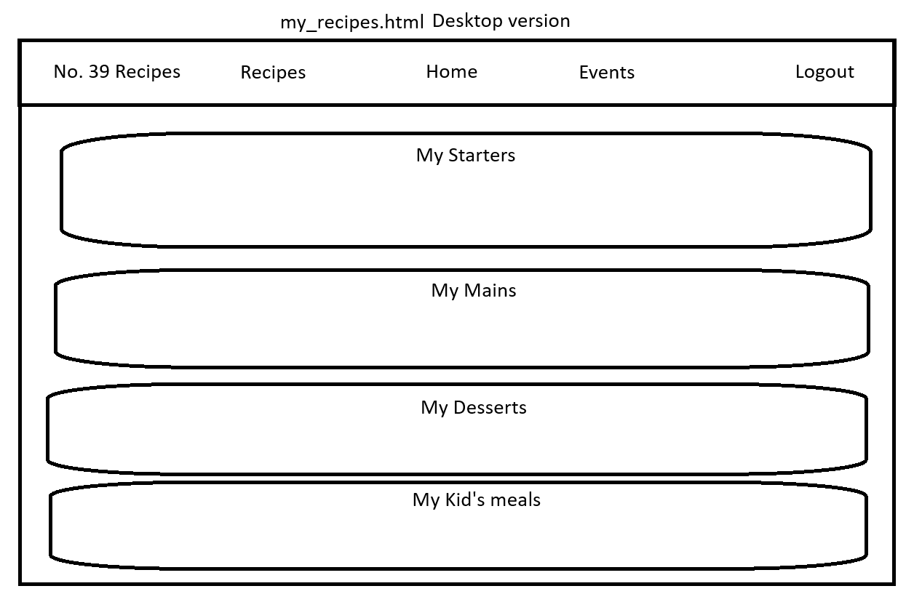
  
  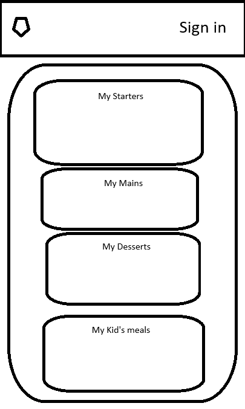
  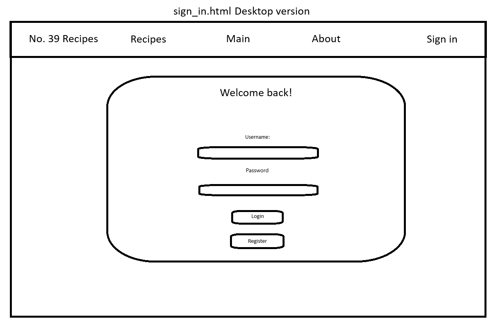
  
  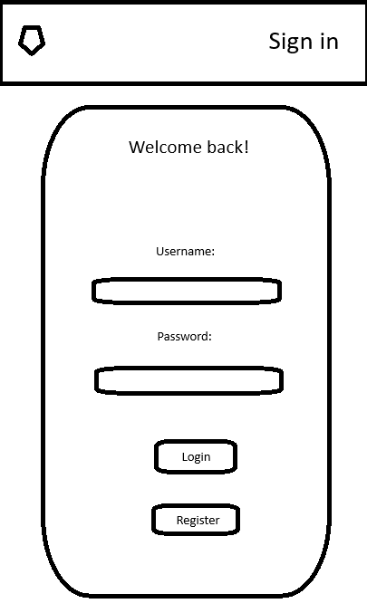
  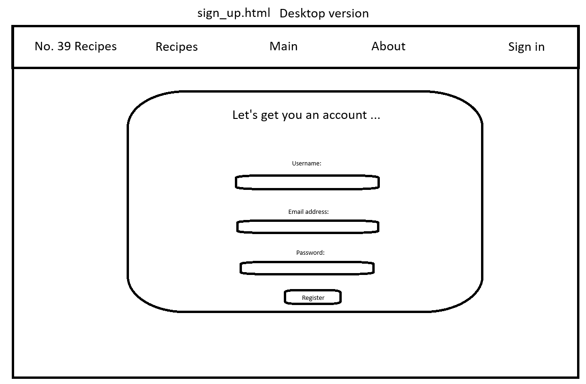
  
  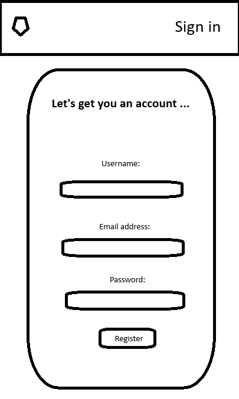

# Features

- ## Existing features

* The user can register an account for themselves, so they can also create, edit and delete their recipes, not just view other's.
* After the user left the website or logged out, they are able to log back in to open a new session where they can alter their recipes.(Update/Delete)
* The main page showcases the newest recipe in it's category. The recipes page showcases the top 4 newest recipes. Users can view all recipes by clicking on the View All button next to the categories' name.

- ## Features left to be implemented

* I would like to add a new column for the Users table, so users can have a role assigned to them
* After the roles have been assigned, I would like to add admin features to "My Profile" page.
* Users will be able to send suggestions to admins
* The admins will be able to accept suggestions and put them on a list.
* These above mentioned tasks will be displayed on the main page to show users what updates to expect in the future.

# Technologies used

1. Languages used:

- HTML
- CSS
- JavaScript
- Python
- PostgresSQL

2. Frameworks, Libraries & Programs Used:

- Tailwind - Used to create boxes for the main and footer sections, and to control some of the animations(e.g. navbar links while hovered over).
- SQLAlchemy - Used to help creating SQL commands in a more pythonian way.
- Flask - Used to run the backend, that have control over the frontend.
- GitHub - Used for making my files available on the web.
- Visual Studio Code - Used for the programming environment

3. Websites used

- [I used stackoverflow to check for solution when I got tired/stuck.](https://stackoverflow.com/)
- [I used w3schools to check for correct syntax whenever I had my code stop working.](https://www.w3schools.com/)
- [The website I used to check if my website is responsive. I also included a screenshot in the testing section.](https://ui.dev/)
- [I used Tailwind's website a lot, especially to get a better idea how to create "boxes" to visually separate areas.](https://tailwind.com/)
- [I used Pexels to find appropriate photos and videos to fit in the subject of my website.](https://www.pexels.com)

# Bugs

It proved to be quite challenging to host my website, as I had trouble signing up to Heroku with the Github Student Pack, so I ended up needing to host my app on another hosting service, called Linode. I learnt how to install an OS(Debian) to serve as my web server, host my website with Apache, create a domain and create A records so the user can reach my app with a domain name rather than the fix IP, route all requests through Cloudflare where I was able to enable Full(strict) mode after a lot of reading about how to get a certificate signed for HTTPS connections and get my Apache server to listen to these 443 requests. I quite enjoyed learning all about these, and I hope I could submit a well designed app too.

# Testing

## Testing with validators

### JSLint

- 


### Lighthouse

- 
- 

## W3C HTML

- 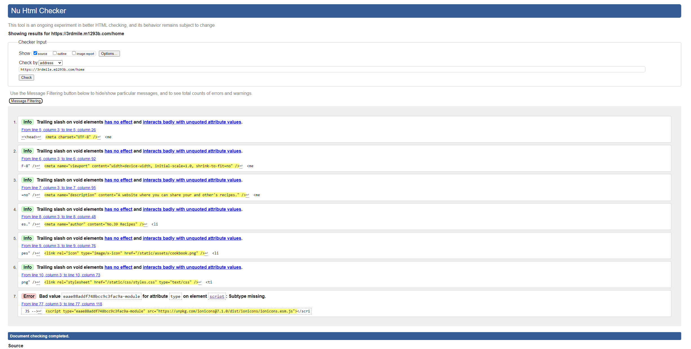
- 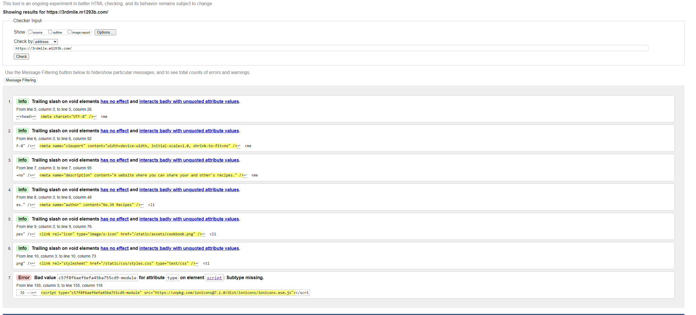
- 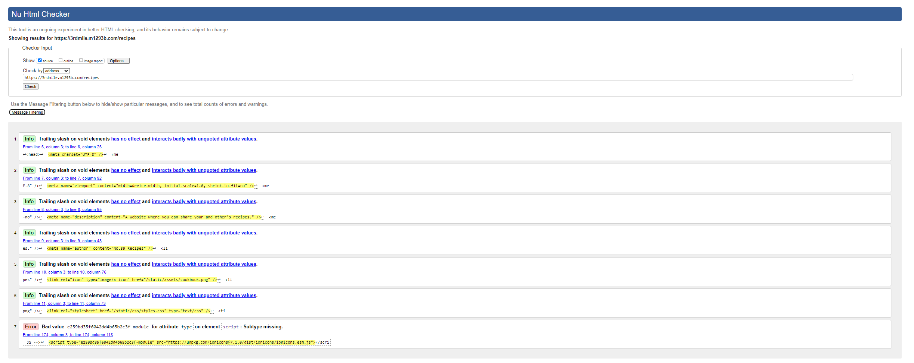
- 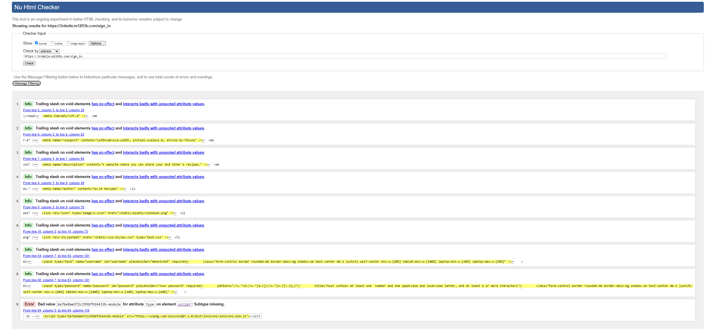
- 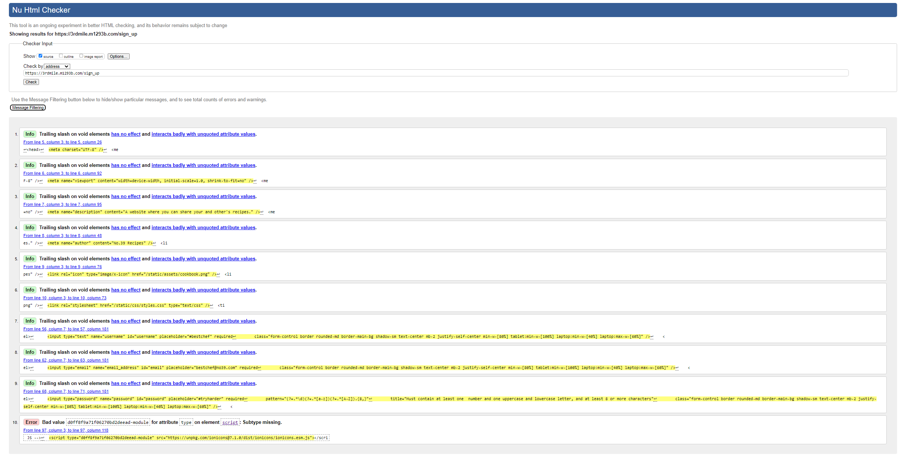

## W3C CSS(Jigsaw)

- 

## Final website

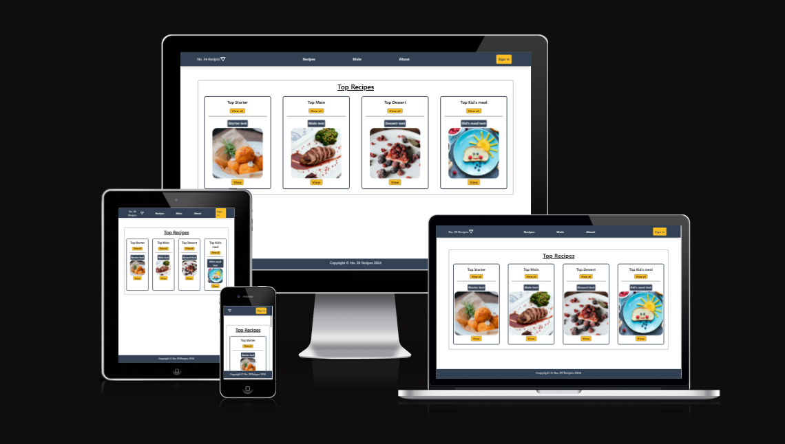

## Manual testing

### User Stories

#### As a

- **Story**: As a newly found home cook, I want an easy way to find a recipe, so that I can start preparing my meal for the upcoming days.
- **Test Result**: The first page the user gets to is

#### As a

- **Story**:
- **Test Result**:

#### As a

- **Story**:
- **Test Result**:

#### As a

- **Story**:
- **Test Result**:

#### As a

- **Story**:
- **Test Result**:

#### As a

- **Story**:
- **Test Result**:

# Credits

1. ## Content

- [The colours used for the website were found on colorhunt.com](https://colorhunt.co/palette/22283131363f76abaeeeeeee)

2. ## Code

- Official site like W3School and Tailwind help to create a great layout that functions well.
- StackOverflow helped me to see how others solved the issues their code had and I manage to use some of the solutions after customising them to fit my code.
- Codeinstitute's walkthrough videos gave me some ideas of how best to manipulate databases with Python. I had to watch other videos as well to fully understand the purpose of the code.

## Deployment

- I used GitHub for version control and Linode to deploy my website. I used Visual Studio Code to access code on my server and to push code to GitHub.

### 1. Server Setup

Ensure your server has Apache, Python, and necessary modules installed:

1. **Update your package list** and install Apache and necessary dependencies:

```bash
sudo apt update
sudo apt install apache2 python3 python3-venv libapache2-mod-wsgi-py3 git
```

2. **Clone the GitHub repository** to your server:

Navigate to the desired directory where the application will be hosted and clone the repository:

```bash
cd /var/www/
sudo git clone https://github.com/codeim1293b/3rd_milestone.git
```

3. **Set up the virtual environment:**

Navigate to the application folder and create a virtual environment for the Flask app:

```bash
cd /var/www/your-flask-app
python3 -m venv venv
source venv/bin/activate
```

4. **Install application dependencies:**

Use pip to install the required packages from the requirements.txt file:

```bash
pip install -r requirements.txt
```

5. **Set up environment variables:**

Create an .env file or export the necessary environment variables for Flask (e.g., SECRET_KEY, FLASK_APP, DATABASE_URI, etc.).

### 2. Configure Apache

1. **Create an Apache configuration file** for your Flask app:

Open a new Apache configuration file for your Flask application:

```bash
sudo nano /etc/apache2/sites-available/your-flask-app.conf
```

Add the following configuration:

```apache
<VirtualHost *:5000>
    ServerName your_domain_or_ip

    WSGIDaemonProcess your-flask-app python-path=/var/www/your-flask-app:/var/www/your-flask-app/venv/lib/python3.8/site-packages
    WSGIProcessGroup your-flask-app
    WSGIScriptAlias / /var/www/your-flask-app/your-flask-app.wsgi

    <Directory /var/www/your-flask-app>
        Require all granted
    </Directory>

    Alias /static /var/www/your-flask-app/static
    <Directory /var/www/your-flask-app/static>
        Require all granted
    </Directory>

    ErrorLog ${APACHE_LOG_DIR}/your-flask-app-error.log
    CustomLog ${APACHE_LOG_DIR}/your-flask-app-access.log combined
</VirtualHost>
```

2. **Create a WSGI entry point for the Flask app:**

In your application directory, create a your-flask-app.wsgi file:

```bash
sudo nano /var/www/your-flask-app/your-flask-app.wsgi
```

Add the following lines to the file:

```python
import sys
import os

# Activate your virtual environment
activate_this = '/var/www/your-flask-app/venv/bin/activate_this.py'
exec(open(activate_this).read(), dict(__file__=activate_this))

sys.path.insert(0, '/var/www/your-flask-app')

from app import app as application
```

3. **Enable the new site configuration and the WSGI module:**

```bash
sudo a2ensite your-flask-app
sudo a2enmod wsgi
```

4. **Restart Apache to apply the changes:**

```bash
sudo systemctl restart apache2
```

### 3. **Set Up Git for Version Control**

1. **Pull latest changes from GitHub:**

If you make updates to your repository, pull the changes directly to the server:

```bash
cd /var/www/your-flask-app
sudo git pull origin main
```

### 4. **Set Up a Firewall**

Allow HTTP and HTTPS traffic by updating your firewall rules:

```bash
sudo ufw allow 'Apache Full'
```

### 5. **Securing the Application**

1. **Install and configure SSL** (optional but recommended):

If using a domain, set up SSL for secure HTTPS access using Certbot:

```bash
sudo apt install certbot python3-certbot-apache
sudo certbot --apache -d your_domain
```

### 6. **Final Checks**

Once all steps are complete, your Flask application should be live and accessible at your server's IP address or domain. You can view the logs for any issues:

```bash
tail -f /var/log/apache2/your-flask-app-error.log
```

This setup ensures your Flask app is running on Apache, with GitHub as the version control system for easy updates. Follow these steps for seamless deployment, and feel free to customize as per your specific setup.
