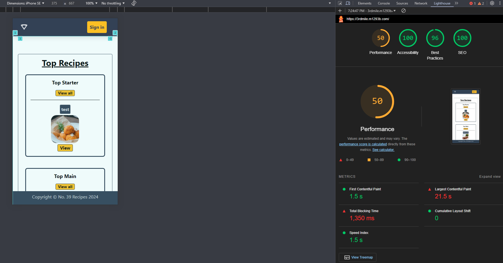
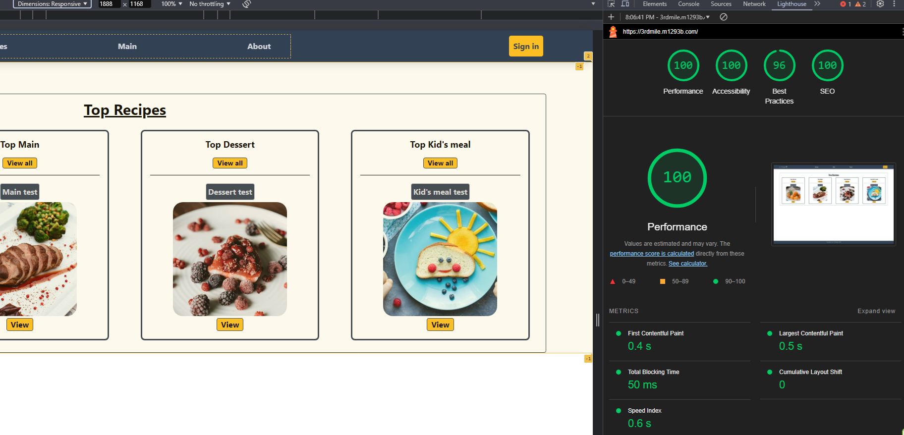
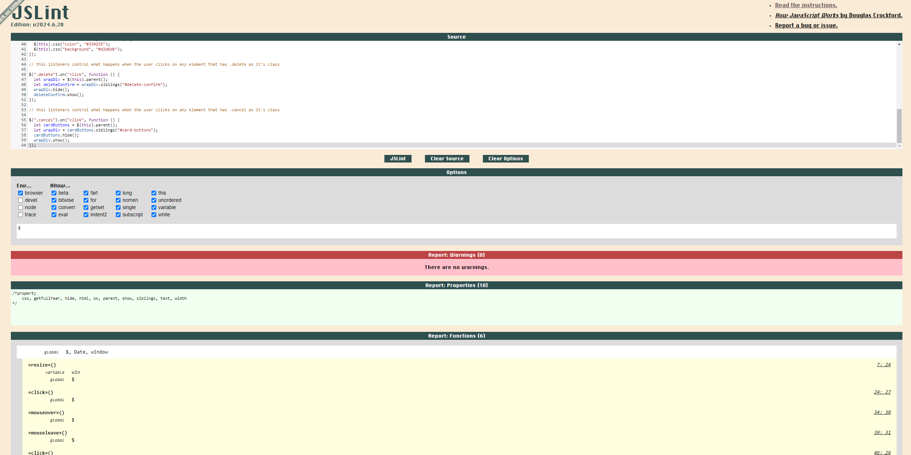
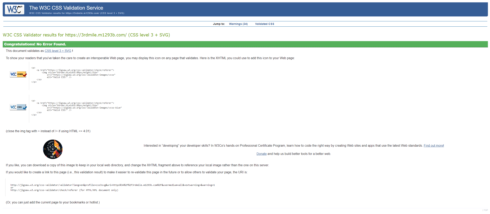

# Table of content:

## UX

- User stories
- Project goals
- Design choices
- Business goals
- Developer goals
- Wire frames

## Features

- Existing features
- Features left to be implemented

## Technologies used

## Bugs

## Testing

- Testing with validators
- Manual testing
- Room category selection
- Add extras

## Credits

- Content
- Media
- Code

## Deployment

---

# UX

- ## User stories

  ### As a newly found home cook

  - **I want** an easy way to find a recipe.
  - **So that** I can start preparing my meal for the upcoming days.

  ### As a parent

  - **I want** be able to find meals that are recommended for kids.
  - **So that** I can prepare a meal for my child as quickly as possible.

  ### As a first time view

  - **I want** to be able to register an account for myself.
  - **So that** I can post my recipes.

  ### As a returning user

  - **I want** to be able to update my recipes.
  - **So that** I can improve them.

  ### As a returning user

  - **I want** to be able to delete my recipes.
  - **So that** I don't have them anymore in my collection.

- ## Project goals

  The goal of this project is to allow users to share their recipes and let them view recipes shared by others as well.

- ## Design choices

  <!--  -->

- ## Business goals

  <!--  -->

- ## Developer goals

  <!--  -->

- ## Wireframes

  
  
  
  
  
  

# Features

- ## Existing features

* The user can register an account for themselves, so they can also create, edit and delete their recipes, not just view other's.
* After the user left the website or logged out, they are able to log back in to open a new session where they can alter their recipes.(Update/Delete)
* The main page showcases the newest recipe in it's category. The recipes page showcases the top 4 newest recipes. Users can view all recipes by clicking on the View All button next to the categories' name.

- ## Features left to be implemented

* I would like to add a new column for the Users table, so users can have a role assigned to them
* After the roles have been assigned, I would like to add admin features to "My Profile" page.
* Users will be able to send suggestions to admins
* The admins will be able to accept suggestions and put them on a list.
* These above mentioned tasks will be displayed on the main page to show users what updates to expect in the future.

# Technologies used

1. Languages used:

- HTML
- CSS
- JavaScript
- Python
- PostgresSQL

2. Frameworks, Libraries & Programs Used:

- Tailwind - Used to create boxes for the main and footer sections, and to control some of the animations(e.g. navbar links while hovered over).
- SQLAlchemy - Used to help creating SQL commands in a more pythonian way.
- Flask - Used to run the backend, that have control over the frontend.
- GitHub - Used for making my files available on the web.
- Visual Studio Code - Used for the programming environment

1. Websites used

- [I used stackoverflow to check for solution when I got tired/stuck.](https://stackoverflow.com/)
- [I used w3schools to check for correct syntax whenever I had my code stop working.](https://www.w3schools.com/)
- [The website I used to check if my website is responsive. I also included a screenshot in the testing section.](https://ui.dev/)
- [I used Tailwind's website a lot, especially to get a better idea how to create "boxes" to visually separate areas.](https://tailwind.com/)
- [I used Pexels to find appropriate photos and videos to fit in the subject of my website.](https://www.pexels.com)

# Bugs

It proved to be quite challenging to host my website, as I had trouble signing up to Heroku with the Github Student Pack, so I ended up needing to host my app on another hosting service, called Linode. I learnt how to install an OS(Debian) to serve as my webserver, host my website with Apache, create a domain and create A records so the user can reach my app with a domain name rather than the fix IP, route all requests through Cloudflare where I was able to enable Full(strict) mode after a lot of reading about how to get a certificate signed for HTTPS connections and get my Apache server to listen to these 443 requests. I quite enjoyed learning all about these, and I hope I could submit a well designed app too.

# Testing

## Testing with validators

- 
- 
- 
- 
- 
- 
- 
- 
-

## JSLint


-


## Lighthouse

  
 

## W3C HTML


## W3C CSS(Jigsaw)


## W3C CSS(Jigsaw)


## Final website


## Manual testing

### User Stories

#### As a

- **Story**:
- **Test Result**:

#### As a

- **Story**:
- **Test Result**:

#### As a

- **Story**:
- **Test Result**:

#### As a

- **Story**:
- **Test Result**:

#### As a

- **Story**:
- **Test Result**:

#### As a

- **Story**:
- **Test Result**:

## Automated testing

I spent a lot of time on the internet, looking for a solution how to test this function. I found the answer after posting on Reddit.
I had to learn how to properly bind the element, so the function can use "this".

- 

## Room category selection testing

-
-

## Add extras

- Admin settings
-

# Credits

1. ## Content

- [The colours used for the website were found on colorhunt.com](https://colorhunt.co/palette/22283131363f76abaeeeeeee)

2. ## Media

- [The picture of the hotel room was found on Pexels.com. Direct link to the page I downloaded the picture from](https://www.pexels.com/photo/cozy-modern-bedroom-3144580/)
- [The picture of the hotel room was found on Pexels.com. Direct link to the page I downloaded the picture from](https://www.pexels.com/photo/interior-of-modern-bedroom-with-soft-bed-and-wooden-walls-6284232/)
- [The picture of the hotel room was found on Pexels.com. Direct link to the page I downloaded the picture from](https://www.pexels.com/photo/a-warm-and-comfortable-place-3688261/)
- [The picture of the hotel room was found on Pexels.com. Direct link to the page I downloaded the picture from](https://www.pexels.com/photo/apartment-interior-with-bed-near-windows-with-curtains-6585757/)
- [The picture of the hotel room was found on Pexels.com. Direct link to the page I downloaded the picture from](https://www.pexels.com/photo/interior-of-cozy-bedroom-with-comfy-bed-and-tv-hanging-over-chest-of-drawers-6527066/)
- [The picture of the hotel room was found on Pexels.com. Direct link to the page I downloaded the picture from](https://www.pexels.com/photo/black-and-grey-bedspread-on-bed-and-pillow-164595/)
- [The picture of the hotel room was found on Pexels.com. Direct link to the page I downloaded the picture from](https://www.pexels.com/photo/black-laptop-placed-on-table-271618/)
- [The picture of the hotel room was found on Pexels.com. Direct link to the page I downloaded the picture from](https://www.pexels.com/photo/stylish-bathroom-with-glass-elements-in-apartment-6032203/)
- [The picture of the hotel room was found on Pexels.com. Direct link to the page I downloaded the picture from](https://www.pexels.com/photo/made-bed-in-spacious-bedroom-with-air-conditioner-6316054/)
- [The picture of the hotel room was found on Pexels.com. Direct link to the page I downloaded the picture from](https://www.pexels.com/photo/interior-details-of-contemporary-bedroom-with-bedside-table-and-wardrobe-6933760/)
- [The picture of the hotel room was found on Pexels.com. Direct link to the page I downloaded the picture from](https://www.pexels.com/photo/home-design-26571204/)
- [The picture of the hotel room was found on Pexels.com. Direct link to the page I downloaded the picture from](https://www.pexels.com/photo/room-with-bed-and-wooden-floor-1743229/)
- [The picture of the hotel room was found on Pexels.com. Direct link to the page I downloaded the picture from](https://www.pexels.com/photo/two-single-beds-in-well-lit-room-2029722/)
- [The picture of the hotel room was found on Pexels.com. Direct link to the page I downloaded the picture from](https://www.pexels.com/photo/clear-glass-shower-room-271631/)
- [The picture of the hotel room was found on Pexels.com. Direct link to the page I downloaded the picture from](https://www.pexels.com/photo/a-simple-bedroom-3659683/)
- [The picture of the hotel room was found on Pexels.com. Direct link to the page I downloaded the picture from](https://www.pexels.com/photo/spacious-bathroom-with-modern-trendy-design-6032424/)
- [The picture of the hotel room was found on Pexels.com. Direct link to the page I downloaded the picture from](https://www.pexels.com/photo/interior-of-stylish-bathroom-in-cottage-6032425/)
- [The picture of the hotel room was found on Pexels.com. Direct link to the page I downloaded the picture from](https://www.pexels.com/photo/classic-bedroom-with-armchairs-and-tv-next-to-bed-6587902/)
- [The picture of the hotel room was found on Pexels.com. Direct link to the page I downloaded the picture from](https://www.pexels.com/photo/bathroom-interior-1457847/)

3. ## Code

- Official site like W3School and Tailwind help to create a great layout that functions well.
- StackOverflow helped me to see how others solved the issues their code had and I manage to use some of the solutions after customising them to fit my code.

## Deployment

- I used GitHub for version control and Linode to deploy my website. I used Visual Studio Code to access code on my server and to push code to GitHub.

### Deploying with GitHub Pages

1. **Push your code to the `main` branch** of your GitHub repository:

   ```sh
   git add .
   git commit -m "Deploy website"
   git push origin main
   ```

2. **Enable GitHub Pages**:

   - Go to your repository on GitHub.
   - Click on `Settings`.
   - Scroll down to the `Pages` section.
   - Under `Source`, select the branch you want to deploy (e.g., `main`) and `/root` folder.
   - Click `Save`.

3. **Access your website**:
   - After a few minutes, your site should be available at `https://<username>.github.io/<repository-name>/`.
